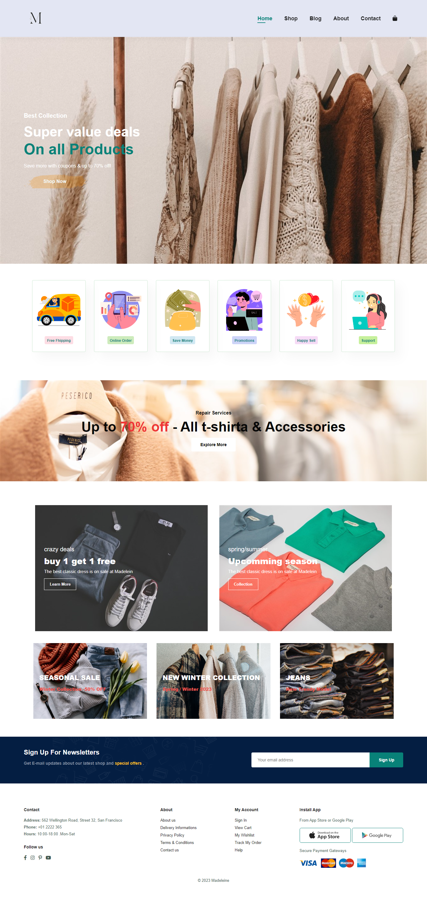

# Madeleine E-Commerce Website

## Project Description

Madeleine is a multi-page e-commerce website built to provide users with a seamless shopping experience. It offers distinct pages, each with a specific purpose, to showcase various information to the users. The website includes a responsive design, pagination, navigation hamburger menu for mobile screens, and a fully functional shopping cart.

## Skills Used

- HTML
- CSS
- JavaScript

## Features

- Multi-page layout with distinct purposes for each page.
- Pagination for smoother navigation.
- Navigation hamburger menu for mobile screens. E-commerce functionality allows users to add products to the cart.
- Option to choose between different methods of payment.

## PagesHome: A landing page with an introduction to the website.

- Shop: Display of products available for purchase.
- Blog: Sharing relevant blog content.
- About: Information about the website or brand.
- Contact: A means for users to get in touch.
- Cart: A functional shopping cart for users to review and purchase products.

## Live Demo

Explore the live demo of Madeleine: [Live Demo](https://madeleinmadelein.netlify.app/)

## Usage

Users can navigate through the different pages of the website to:

- Explore the product offerings in the Shop section.
- Read and engage with blog content.
- Learn more about the website and its purpose in the About section.
- Contact the team through the Contact page.
- Add products to the cart and proceed with the order.

## Technologies Used

Madeleine was developed using the following skills and technologies:

- HTML
- CSS
- JavaScript

## Contact Information

If you have any inquiries or feedback, feel free to contact me:

- Email: your.email@example.com

## Acknowledgments

I would like to acknowledge the following resources and tools that contributed to the development of Madeleine:

- [Font Awesome](https://fontawesome.com/)
- [Netlify](https://www.netlify.com/)
